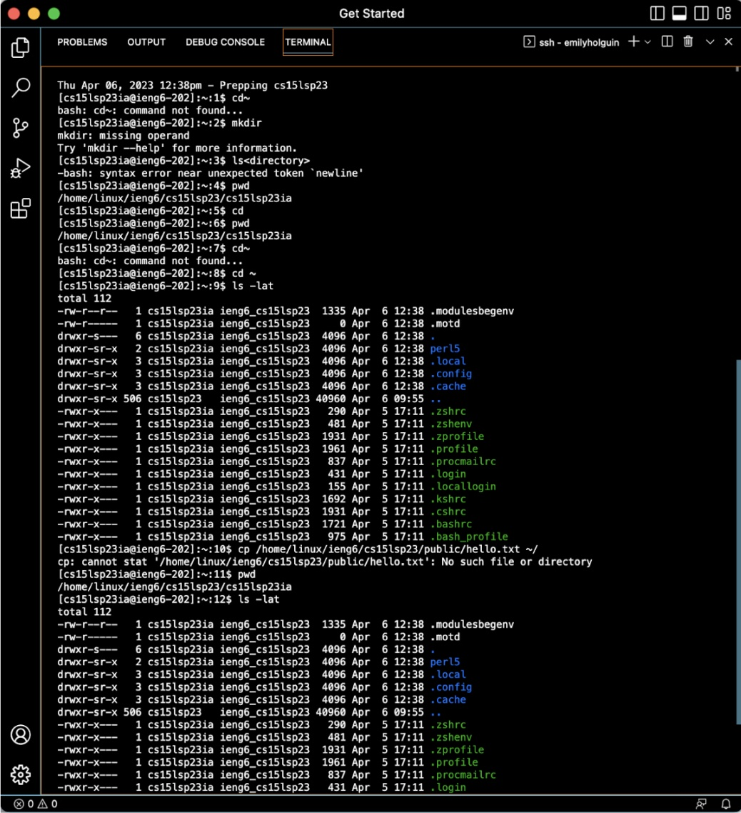

# Lab Report 1 - Week 1
This tutorial will cover remote access to a course-specific account on `ieng6`.

## Installing VS Code
[Download](https://code.visualstudio.com/download) the correct option for your operation system(Windows, mac, etc). (If I am on a Mac, for example I should download the VS Coder installer for Mac.

Once launched, you should see a screen similar to the one below:

## Remotely Connecting
In this section, we will learn how to use VSCode to connect to a remote computer.

**Set up your course-specific account**

First step is to look up your course-specific account for CSE15L with this link:[ETS](https://sdacs.ucsd.edu/~icc/index.php)
* There, you will find your username, which should look similar to "cs15sp23ii."

**Using `ssh`**

This step is to open VSCode to connect to the remote computer.
1. Open a terminal in VSCode(on Mac, using the menu at the top(Terminal > New Terminal)
2. Using the following command in the terminal:

* `$ ssh cs15lsp23ii@ieng6.ucsd.edu`
  * >"ii" should be replaced with your specific account's username
3. After running the command, you should see an output that looks like this: ``The authenticity of host 'ieng6-202.ucsd.edu (128.54.70.227)' can't be established.
RSA key fingerprint is SHA256:ksruYwhnYH+sySHnHAtLUHngrPEyZTDl/1x99wUQcec.
Are you sure you want to continue connecting (yes/no/[fingerprint])? 
Password: ``
* Type in "yes" which lets you connect to a new server for the first time. After it should ask you for your password that you created in ETS. 

4. Finally, you should see a output similar to the one below:

**Now your computer is connected to a computer in the CSE basement and any commands that are ran will run on that computer!!**

## Trying Some Commands

Try using some commands listed below both on your computer and on the remote computers after ssh-ing in the terminal in VScode.
> *Tip:* Pressing the "up" button on your keyboard will prompt the last executed command on the terminal!

* `cd ~`
* `cd`
* `ls -lat`
* `ls -a`
* `ls <directory>` where `<directory>` is `/home/linux/ieng6/cs15lsp23/cs15lsp23abc`, where the `abc` is one of the other group members’ username
* `cp /home/linux/ieng6/cs15lsp23/public/hello.txt ~/`
* `cat /home/linux/ieng6/cs15lsp23/public/hello.txt`

Your terminal should look similar to the one below while trying the different commands:

**To log out of the remote server in your terminal** 

Execute "Control-D" or running the command `exit` in the terminal

