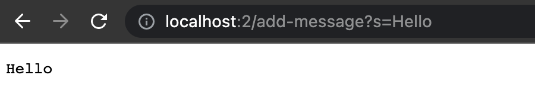

# Lab Report 1 - Week 3 (Servers & Bugs) 

## Part 1 : String Server

**Code**

```
import java.io.IOException;
import java.net.URI;

class StringHandler implements URLHandler
{
    private String string = "";

    @Override
    public String handleRequest(URI url)
    {
        String[] param = url.getQuery() != null ? url.getQuery().split("=") : new String[0];
        String[] rawPath = url.getPath().split("/");
        int countPath = 0;
        for (String p : rawPath)
        {
            if (!p.isEmpty())
                countPath++;
        }

        String[] newpath = new String[countPath];
        countPath = 0;
        for (String p : rawPath)
        {
            if (!p.isEmpty())
            {
                newpath[countPath] = p;
                countPath++;
            }
        }

        if (newpath.length == 0)
            return "nothing here: no params";

        if (newpath[0].equals("add-message"))
        {
            if (param.length == 0)
                return "couldn't parse params: no params";

            if (param.length > 2)
                return "couldn't parse params: too many params";
            
            if (param[0].equals("s"))
            {
                string += param[1] + "\n";
                return string;
            }

            return "unrecognized param: " + param[0];
        }
        
        return "nothing here: unrecognized path";
    }
}

public class StringServer
{
    public static void main(String[] args) throws IOException
    {
        if(args.length == 0)
        {
            System.out.println("Missing port number! Try a different number!");
            return;
        }

        int temp = Integer.parseInt(args[0]);

        Server.start(temp, new StringHandler());
    }
}
```

** Examples using `/add-message`**



The URL used is `localhost:2/add-message?s=Hello`


