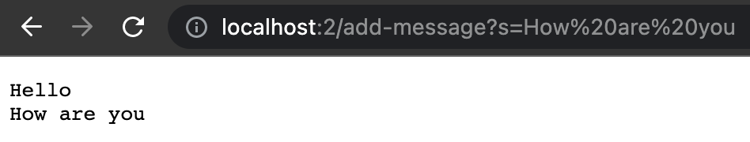
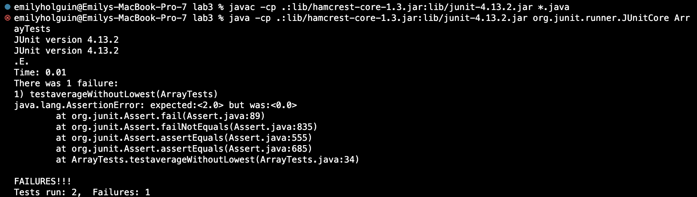

# Lab Report 2 - Week 3 (Servers & Bugs) 

## Part 1 : String Server

**Code**

```
import java.io.IOException;
import java.net.URI;

class StringHandler implements URLHandler
{
    private String string = "";

    @Override
    public String handleRequest(URI url)
    {
        String[] param = url.getQuery() != null ? url.getQuery().split("=") : new String[0];
        String[] rawPath = url.getPath().split("/");
        int countPath = 0;
        for (String p : rawPath)
        {
            if (!p.isEmpty())
                countPath++;
        }

        String[] newpath = new String[countPath];
        countPath = 0;
        for (String p : rawPath)
        {
            if (!p.isEmpty())
            {
                newpath[countPath] = p;
                countPath++;
            }
        }

        if (newpath.length == 0)
            return "nothing here: no params";

        if (newpath[0].equals("add-message"))
        {
            if (param.length == 0)
                return "couldn't parse params: no params";

            if (param.length > 2)
                return "couldn't parse params: too many params";
            
            if (param[0].equals("s"))
            {
                string += param[1] + "\n";
                return string;
            }

            return "unrecognized param: " + param[0];
        }
        
        return "nothing here: unrecognized path";
    }
}

public class StringServer
{
    public static void main(String[] args) throws IOException
    {
        if(args.length == 0)
        {
            System.out.println("Missing port number! Try a different number!");
            return;
        }

        int temp = Integer.parseInt(args[0]);

        Server.start(temp, new StringHandler());
    }
}
```

**Examples using `/add-message`**


The URL used is `localhost:2/add-message?s=Hello`

The method `StringHandler.handleRequest(URI url)` is being called with the argument being a URI object that represents the URL which is `localhost2:2/add-message?s=Hello`. The method anaylzes the URI and changes the `StringHandler`'s `String string` field to add the `Hello` string.



The URL used are `localhost:2/add-message?s=How are you`

The method `StringHandler.handleRequest(URI url)` is being called with the argument being a URI object that represents the URL which is `localhost2:add-message?s=How are you`. The method anaylzes the URI and adds it to the `StringHandler`'s `String string` field to add the `How are you` string after the `Hello` string. 

## Part 2 : Bug Test

Bug Test in the `ArrayExamples.averageWithoutLowest(double[])` method.

**Failing Input**

Test 

```
@Test
  public void testaverageWithoutLowest(){
    double[] input1 = {2.0,2.0,2.0};
    double test = ArrayExamples.averageWithoutLowest(input1);
    assertEquals(2.0, test, 0.0);
  }
```

**Passing Input**

Test:

```
@Test
  public void testaverageWithouthLowest2(){
    double[] input1 = {2.0, 4.0, 6.0};
    double test = ArrayExamples.averageWithoutLowest(input1);
    assertEquals(5.0, test, 0.0);
  }
```

Output of Both Tests Together:



**Bug Fix**

Before:

```
static double averageWithoutLowest(double[] arr) {
    if(arr.length < 2) { 
        return 0.0; 
    }
    double lowest = arr[0];
    for(double num: arr) {
      if(num < lowest) { 
        lowest = num; 
      }
    }
    double sum = 0;
    for(double num: arr) {
      if(num != lowest) { 
        sum += num; 
      }
    }
    return sum / (arr.length - 1);
  }
  ```
  
  After: 
  
  ```
static double averageWithoutLowest(double[] arr) {
    if (arr.length < 2)
        return 0.0;

    int lowestIndex = 0;
    for (int i = 0; i < arr.length; i++)
    {
      if (arr[i] < arr[lowestIndex]){
        lowestIdx = i;
      }
    }

    double sum = 0;
    for (int i = 0; i < arr.length; i++)
    {
      if (i != lowestIndex){
        sum += arr[i];
      }
    }

    return sum / (arr.length - 1);
  }
```

The bug in the original code was that it was checking if an element is equal to the lowest value, so if there are multiple of the same element that match the lowest value, then all of them are removed. Which is why in the first test fails since it has duplicates and the second test passes(no duplicates). To fix the bug, the code has to keep track of the specific index where the lowest value was found. With this, only one element with the specific index will be removed. 

## Part 3 : Something I Learned 
I learned how to make a web server where the program will take a URL as an input and respond with the text of a web page as I never knew that it was possible to do it. With the URL a query can be added to it so a String could be added or increment a value, with multiple people doing it at the same time it will continue to work. 
