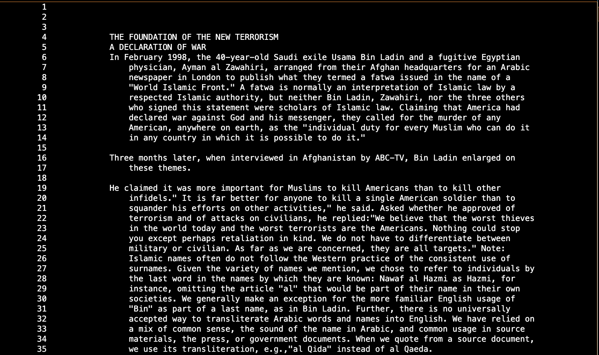

# Lab Report 3 - Week 5 (Researching Commands)

## *Others ways to use `less` command*

___
## less -p[string] [file path]

This alternate way of the `less` command will highlight any occurance of the string that was passed in the given file. When this command is use, it will go to the first occurence of the string in the file. 

**Example 1:**

Input: 

```
emilyholguin@Emilys-MacBook-Pro-7 docsearch % less -pPresident technical/911reports/chapter-1.txt
```

Output:


  
The output shows that we are searching for "President" in the file. As it highlights the word throughout the file. 

**Example 2:**

Input: 

```
emilyholguin@Emilys-MacBook-Pro-7 docsearch % less -pEmily technical/government/About_LSC/Progress_report.txt
```

Output:


In this example, we are searching for "Emily" in the file. However it did not find any occurences of the string which is why we got the above output. 

This command was found using `man find` in the terminal.

____

## less -X[file path]

This command leaves the contents of the file in the terminal after exiting. As you are able to control how much of the file will be represented in the terminal. This is useful for when you need to reference back to something in the file when you are in the terminal.

**Example 1**

Input:

```
emilyholguin@Emilys-MacBook-Pro-7 docsearch % less -X technical/biomed/1468-6708-3-1.txt
```

Output:


-X allows you to decide how much of the file will display on the terminal as you are able to adjust the length of how much text to show. This is helpful when you might want to see a snippet of the file or a large part of it without having to scroll through the file again. 

**Example 2**

Input:

```
emilyholguin@Emilys-MacBook-Pro-7 docsearch % less -X technical/plos/journal.pbio.0020010.txt
```

Output:


With the contents being in the terminal, it is easier to reference back to it than looking through the file over again. As the docsearch % is on the bottom of the pictures showing that we are back in the terminal with the portion of content saved. 

This command was found using `man find` in the terminal.

___
## less -N [file name]

This command will display line numbers of the specific file so it is easier to find a certain part of the text in the file. 

**Example 1**

Input:

```
emilyholguin@Emilys-MacBook-Pro-7 docsearch % less -N technical/911report/chapter-2.txt
```

Output:



This command is displaying line numbers on the side of the text file to make it easier to find a specific text again. As this is helpful because it is easier to locate a specific issue or text.  

**Example 2**

Input: 

```
emilyholguin@Emilys-MacBook-Pro-7 docsearch % less -N technical/government/media/A_helping_hand.txt
```

Output:


The output shows the file from technical to government to the media file with the A helping hand text with the line numbers on the side to make it easier to find something in the text.  

This command was found using this [link](https://phoenixnap.com/kb/less-command-in-linux)

___

## less -s [file name]

This comamnd will squeeze mutiple blank lines from a text file into one blank line. This command helps the less command show more of the file's content on the screen without having to scroll as much. 

Before file:


Input:

```
emilyholguin@Emilys-MacBook-Pro-7 docsearch % less -s technical/government/media/Annual_Fee.txt
```

Output:


This output is showing that there is less blank linkes in the beginning of the text file so that there will be more content of the the text to be shown. This is helpful because it allows the user to see more text at once or to take a picture of the text together rather than having to take mutiple pictures.  

**Example 2:**

Before File: 


Input:

```
emilyholguin@Emilys-MacBook-Pro-7 docsearch % less -s technical/government/media/Avoids_Budget_Cut.txt
```

Output:


This output is showing that there is less blank linkes in the beginning of the text file so that there will be more content of the the text to be shown. This is helpful because it allows the user to see more text at once or to take a picture of the text together rather than having to take mutiple pictures.  

This command was found using this [link](https://phoenixnap.com/kb/less-command-in-linux)

___
