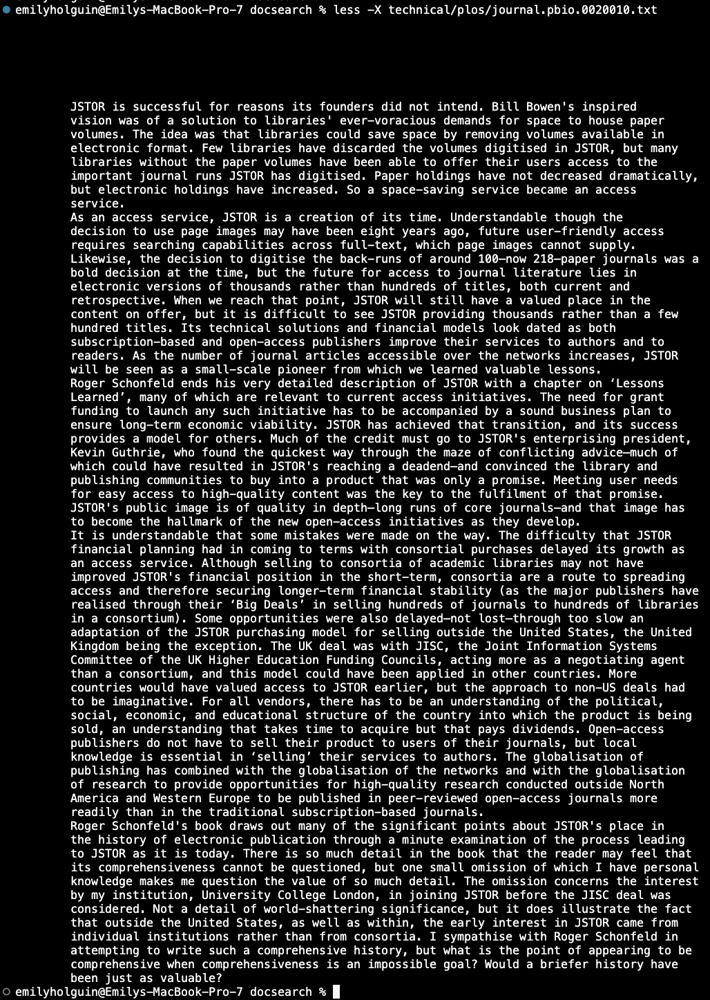

# Lab Report 3 - Week 5 (Researching Commands)

## *Others ways to use 'find' command*

___
> **less -p[string] [file path]**
___
This alternate way of the 'find' command will highlight any occurance of the string that was passed in the given file. When this command is use, it will go to the first occurence of the string in the file. 

**Example 1:**

Input: 

```
emilyholguin@Emilys-MacBook-Pro-7 docsearch % less -pPresident technical/911reports/chapter-1.txt
```

Output:


  
The output shows that we are searching for "President" in the file. As it highlights the word throughout the file. 

**Example 2:**

Input: 

```
emilyholguin@Emilys-MacBook-Pro-7 docsearch % less -pEmily technical/government/About_LSC/Progress_report.txt
```

Output:


In this example, we are searching for "Emily" in the file. However it did not find any occurences of the string which is why we got the above output. 

This command was found using `man find` in the terminal.
____

> less -X[file path]
___

This command leaves the contents of the file in the terminal after exiting. As you are able to control how much of the file will be represented in the terminal. This is useful for when you need to reference back to something in the file when you are in the terminal.

**Example 1**

Input:

```
emilyholguin@Emilys-MacBook-Pro-7 docsearch % less -X technical/biomed/1468-6708-3-1.txt
```

Output:


-X allows you to decide how much of the file will display on the terminal as you are able to adjust the length of how much text to show. This is helpful when you might want to see a snippet of the file or a large part of it without having to scroll through the file again. 

**Example 2**

Input:

```
emilyholguin@Emilys-MacBook-Pro-7 docsearch % less -X technical/plos/journal.pbio.0020010.txt
```

Output:



With the contents being in the terminal, it is easier to reference back to it than looking through the file over again. As the docsearch % is on the bottom of the pictures showing that we are back in the terminal with the portion of content saved. 

This command was found using `man find` in the terminal.

---
> 
